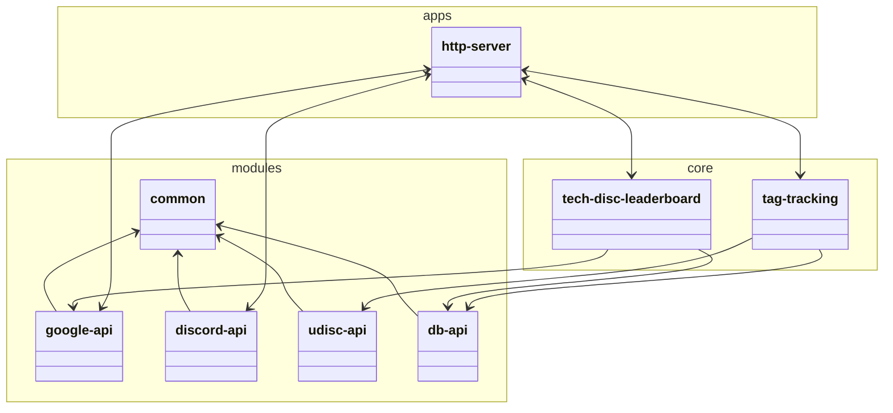

# Architecture

Chat bots that integrate with discord aren't necessarily easy to test unless they're broken up into smaller modules.

The hosted app will be an `HTTPS` server allowing for heartbeat monitoring and general statistics for debugging.

`core` will consist of the units that contain the logic to deliver the functionality. An example would be `tag-tracking` containing the logic for what happens when `tag-bot` related messages are recieved from the `discord-api`, but does not itself respond, that responsibility lies on the `http-server`.

`modules` consists of the smaller reusable chunks of code that can be shared freely between any other package. `common` will house utility functions as well as type defintions for models used between layers.
